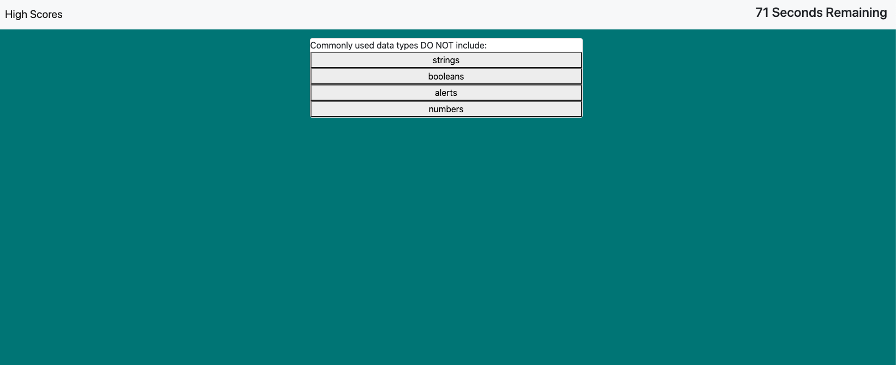
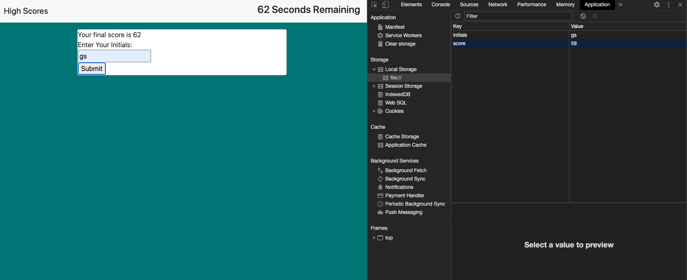

# Beginner Code Quiz

## Description

This is a short quiz to for beginner coders to take as a game. There is a timer of 75 seconds that begins when the user clicks "start quiz" and the first question comes up. 

### Usage

Each time the user selects an incorrect answer their time left decreases by 10 seconds. The game is over when the time runs out or when all the questions are finished. The score is calculated by the amount of time left when the quiz is finished. When the quiz is finished the user is promped to enter their initials and then their initials and score are stored in local storage. 

### Screenshots
#### Initial welcome when opening the website:

#### First Questions with timer running:

#### Local Storage

### Links
Link to github reposity: https://github.com/gtscott90/code-quiz
Link to deployed application: https://gtscott90.github.io/code-quiz/
